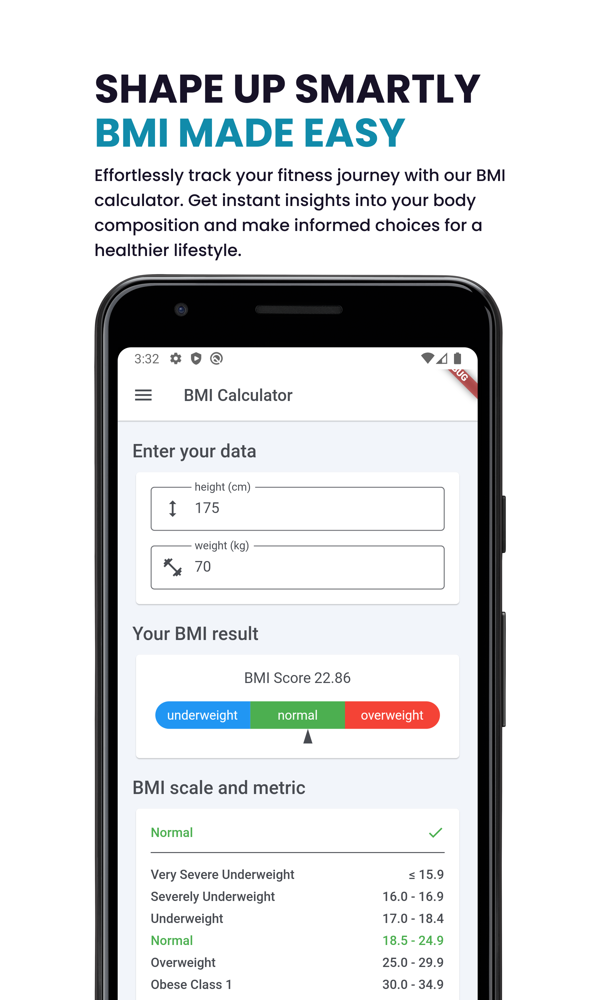
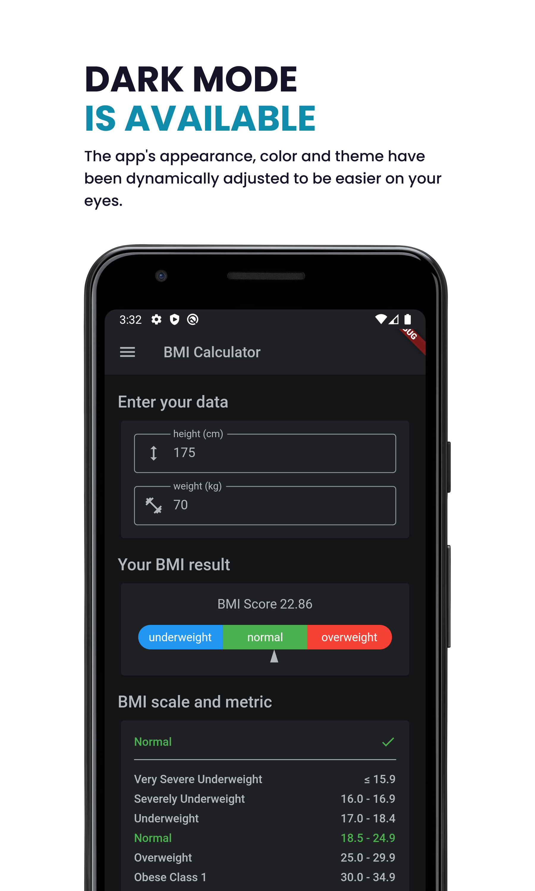

  

 

## VentFit
VentFit — Empower your health journey.   
Health measurement app (BMI Calculator and more) built with flutter and newest architecture guide

 

  
  
  

 

## 📱 Features
- [v] Minimal and Aesthetic UI
- [v] Calculate BMI using the WHO Standard
- [v] Dark Mode Theme
- [v] In App Update

 

## 🖨 Downloads

 
 
**Runs on Android 5.1 and up**

 

## 📑 Installation Steps
The binary file consist of 3 file (source codes and debug apk)
1. [Download the app](https://github.com/HellBus1/VentFit/releases) by clicking the green button or this link.

For App :

1. Locate the file and install, you might get a warning (allow install from untrusted source), that's because the app isn't from the playstore, but it's safe to install.
2. After installing, you should be able to use the app.

For Source Code :

1. Clone the repository or download source code.zip / source code.tar.gz
2. Extract the source code
3. Open with android studio and wait the build until done

 

## 📑 Contribution Guide
GitHub provides a comprehensive contribution guide for public repositories, which can be found here: https://docs.github.com/en/get-started/quickstart/contributing-to-projects. You can also apply this method in this repository by using the "fork & pull request" feature. In addition, please follow these rules:

1. Fork main repository   
2. After forking from the main repository, clone your fork to your local machine.
3. Create a branch from "staging." After making your improvements, create the pull request there.
4. To keep your fork updated and prevent conflicts, you must sync your fork (for a complete guide, read it here: https://docs.github.com/en/pull-requests/collaborating-with-pull-requests/working-with-forks/syncing-a-fork). Make sure to do this before submitting your pull request.
5. You can also open issues, and I will be happy to work on them immediately.

 

## 📑 Contact
Please feel free to reach out to me via email, Twitter, or LinkedIn if you have anything to discuss. And if you like this project, don't forget to leave a clap to my medium or star to show your support.
